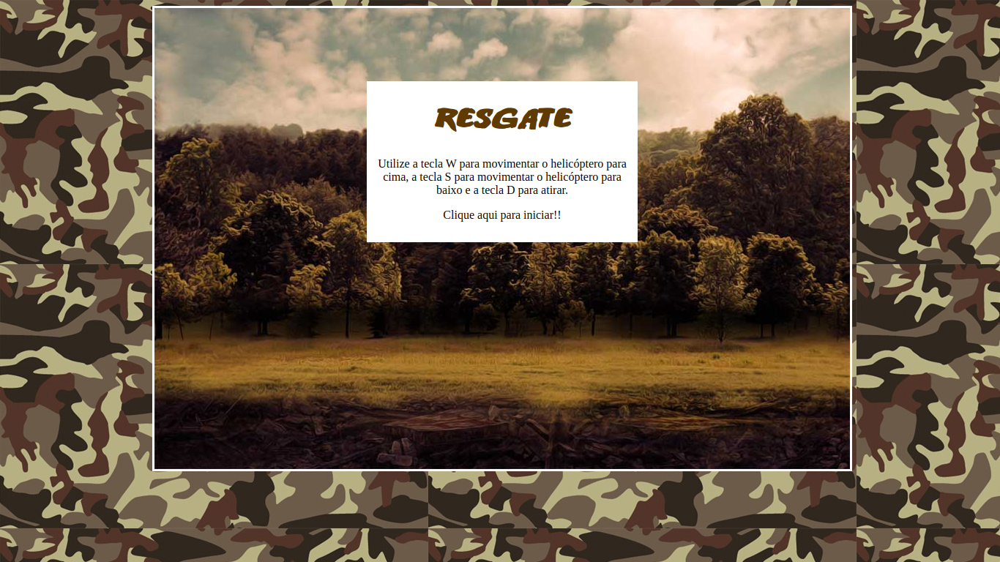
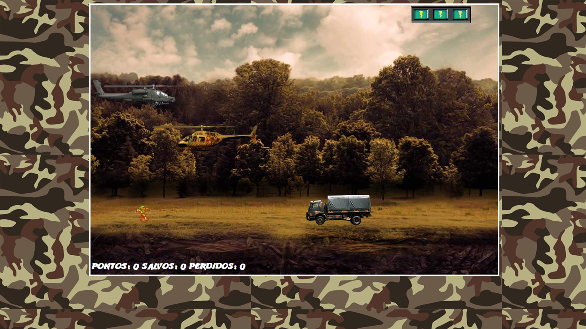
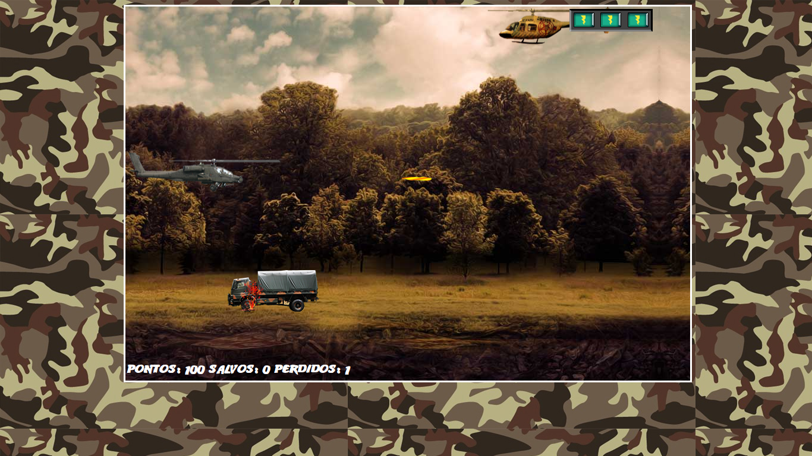

# Jogo_de_HelicopteroJs

### Projeto consiste na criação de um jogo de naves na qual o objetivo é o resgate do indivíduo que aparece na tela enquanto sobrevive aos dois inimigos, sendo um dos inimigo outra aero nave e o outro um caminhão. As tecnologias utilizadas nesse projetos foram HTML5, CSS3 e JavaScript com Jquery Colision que realiza a detecção todas as colisões presentes no jogo. Neste projeto eu consolidei mais ainda meus fundamentos de como criar e utilizar funções em JavaScript, técnicas de CSS3 como containers e variáveis, como posicionar os elementos e como utilizar plugins JQuery a favor desta aplicação.

#### Comandos de movimentação:

Tecla: 'W' movimenta a aeronave para cima

Tecla: 'S' movimenta a aeronave para baixo

Tecla: 'D' Dispara míssel

  <a href="https://github.com/Victor160197">
  
  
  

